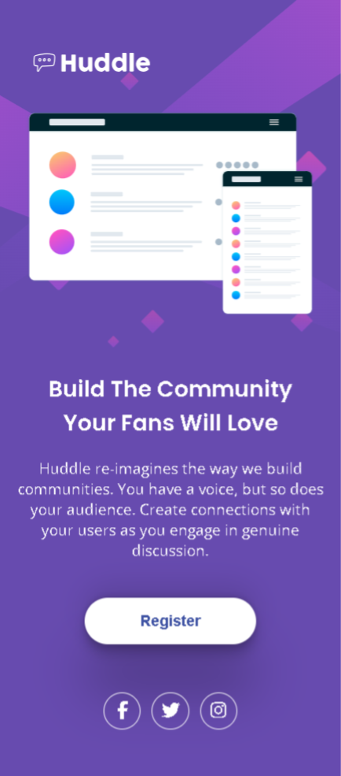
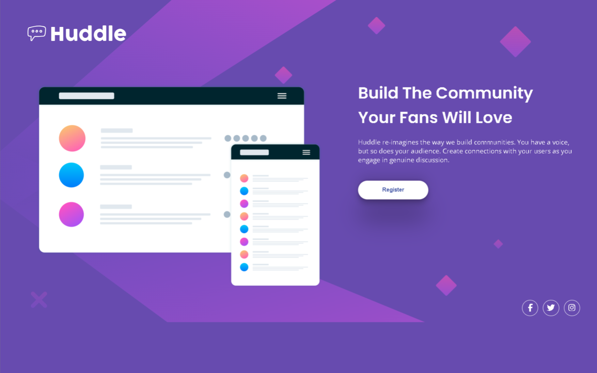

# QUEST HTML + CSS AVANÇADO

Nesta Quest, o objetivo era criar um layout responsivo, de acordo com o design proposto em arquivo. 

## Tecnologias utilizadas

 - HTML
 - CSS

## Design das telas - 📱💻

### Tela Mobile 

### Tela Desktop

### Ícones

Os ícones usados foram do site [Font Awesome] - (https://fontawesome.com/).
